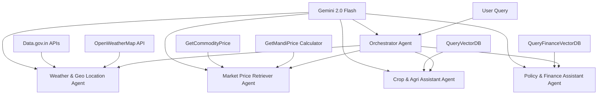

# 🌾 AgriVerse
**Smart Multi-Agent Agricultural Intelligence Platform**

[](https://n8n.io/)
[](https://www.python.org/downloads/)
[](https://reactjs.org/)
[](https://www.typescriptlang.org/)
[](https://fastapi.tiangolo.com/)
[](https://bun.sh/)
## 🎯 About AgriVerse

AgriVerse is a comprehensive AI-powered agricultural advisory platform that revolutionizes farming intelligence through a sophisticated **multi-agent system**. This platform democratizes agricultural expertise by making advanced AI accessible to farmers, agricultural specialists, researchers, and policymakers worldwide.

### 🚀 What Makes AgriVerse Different?

**This is not just another LLM wrapper.** AgriVerse is a fully agentic system featuring:

- **🧠 Intelligent Orchestrator Agent**: Central coordination hub that intelligently routes queries to specialized sub-agents
- **🔄 Four Specialized Sub-Agents**: Each expertly trained in specific agricultural domains
- **🌍 True Multilingual Support**: Native language interaction for global accessibility
- **⚡ Real-Time Intelligence**: Live weather data and environmental insights
- **📚 Knowledge-Augmented Reasoning**: Integration with trusted agricultural research and government datasets

---

## 🏗️ System Architecture



## ✨ Key Features

### 🤖 Multi-Agent Intelligence
- **Orchestrator Agent**: Intelligent query routing and coordination
- **Weather & Geo Location Agent**: Real-time weather analysis and geographical insights
- **Market Price Retriever Agent**: Live commodity and mandi price intelligence
- **Crop & Agri Assistant Agent**: Agricultural best practices and crop management expertise
- **Policy & Finance Assistant Agent**: Government schemes, subsidies, and financial guidance
- **Collaborative Reasoning**: Agents work together to provide comprehensive agricultural solutions

### 🌐 Multilingual Accessibility
- Support for English, Hindi, and regional Indian languages
- Automatic language detection and translation
- Culturally-aware responses for different farming communities

### 📊 Real-Time Data Integration
- **Weather Intelligence**: OpenWeatherMap API for hyperlocal weather data and geographical insights
- **Market Intelligence**: Live mandi prices and commodity rates through price calculator tools
- **Government APIs**: Integration with data.gov.in for official agricultural and policy data
- **Vector Search**: Specialized databases for crop knowledge and financial guidance

### 🎨 Modern Full-Stack Application
- **Responsive Frontend**: Built with React and TailwindCSS
- **High-Performance Backend**: FastAPI with async processing
- **Vector Search**: ChromaDB for semantic knowledge retrieval
- **State-of-the-Art AI**: Powered by Google Gemini 2.0 Flash

---

## 🛠️ Technology Stack

| Component | Technology | Purpose |
|-----------|------------|---------|
| **Frontend** | Nextjs + TypeScript | Modern, responsive user interface |
| **Backend** | FastAPI + Python 3.12+ | High-performance API server |
| **AI Engine** | Google Gemini 2.0 Flash | Advanced language understanding |
| **Pipelining** | Langchain | Simplifying Embedding and Vector Generation |
| **Vector Database** | ChromaDB | Semantic search and knowledge retrieval |
| **Embeddings** | HuggingFace Sentence Transformer (all-MiniLM-L6-v2) | Text embedding generation |
| **Weather Data** | OpenWeatherMap API | Real-time weather and location intelligence |
| **Market Data** | data.gov.in APIs | Live mandi and commodity pricing |
| **Policy Data** | data.gov.in + Vector DB | Government schemes and financial guidance |
| **Agent Framework** | n8n | Intelligent query orchestration |

---

## 🚀 Quick Start Guide

### Prerequisites

Before you begin, ensure you have the following installed:
- [Docker](https://docs.docker.com/get-docker/) installed and running.
- [Docker Compose](https://docs.docker.com/compose/install/) installed.
- (Optional, for local non-Docker runs) [Node.js](https://nodejs.org/en/download/) (v18+) and [Python](https://www.python.org/downloads/) (3.12+).

### Running with Docker (Recommended)

To run the entire platform simply using Docker Compose:

1. **First-time setup and build**:
   ```bash
   docker-compose up --build
   ```

2. **For subsequent uses (no build required)**:
   ```bash
   docker-compose up
   ```

### 📍 Endpoints and Access

Once the containers are up and running, you can access the services at the following endpoints:

- **Frontend App**: [http://localhost:3000](http://localhost:3000)
- **Backend API Server**: [http://localhost:8000](http://localhost:8000) (Swagger UI: [http://localhost:8000/docs](http://localhost:8000/docs))
- **n8n Workflow Automation**: [http://localhost:5678](http://localhost:5678)

### ⚙️ n8n Configuration & API Keys

To make the multi-agent system fully functional, you need to set up the following APIs in n8n (accessible at [http://localhost:5678](http://localhost:5678)):

1. **Gemini API**:
   - Go to [Google AI Studio](https://aistudio.google.com/) and get a **free API key**.
   - In n8n, configure your Gemini node with this API key.
2. **Weather API**:
   - Create a free account at [OpenWeatherMap](https://openweathermap.org/) and generate an API key.
   - Configure the HTTP node in n8n for weather data with this key.
3. **Mandi and Commodity Prices (data.gov.in)**:
   - Create an account on [data.gov.in](https://data.gov.in/) to get your free API key.
   - Use this API key for retrieving live Mandi and Commodity prices.
4. **Setting up HTTP Node Credentials**:
   - In the n8n UI, go to **Credentials** -> **Add Credential** -> Search for **Header Auth** (or the corresponding auth type).
   - Set up your API keys for the HTTP nodes used in the workflow.

### 💻 Local Development (Without Docker)

If you prefer to run each directory locally without Docker, follow these steps:

#### 1. Backend

```bash
cd backend
python -m venv venv
source venv/bin/activate  # On Windows: venv\Scripts\activate
pip install -r requirements.txt
python main.py
```
The backend will be available at [http://localhost:8000](http://localhost:8000).

#### 2. Frontend

```bash
cd frontend
npm install
npm run dev
```
The frontend will be available at [http://localhost:3000](http://localhost:3000).

#### 3. n8n (using npx)

```bash
npx n8n
```
n8n will be available at [http://localhost:5678](http://localhost:5678).

---

- **Docker and Docker Compose** ([Download Docker](https://www.docker.com/products/docker-desktop/))
- **Git** ([Download Git](https://git-scm.com/downloads))

*Note: For manual setup without Docker, you will also need Python 3.12+ and Bun v1+.*

### API Keys Required

You'll need to obtain the following API keys:

1. **Google Gemini API Key**
   - Visit [Google AI Studio](https://aistudio.google.com/app/apikey)
   - Create a new API key
   - Save it securely

2. **OpenWeatherMap API Key**
   - Visit [OpenWeatherMap API](https://openweathermap.org/api)
   - Sign up for a free account
   - Generate an API key

3. **Data.gov.in API Key**
   - No Need as as Free Public Keys are Used

---

## 📦 Installation & Setup (Docker Recommended)

### 1. Clone the Repository

```bash
git clone https://github.com/Ilesh-Dhall/agriverse-core.git
cd agriverse-core
```

### 2. Download the Vector Databases
Before starting the containers, populate the vector databases:
```bash
cd backend
chmod +x vectordb_setup.sh
./vectordb_setup.sh
cd ..
```
To build it from scratch instead [refer here](#manual-vector-database-setup-optional). (Optional)

### 3. Start the Platform
Run the entire stack using Docker Compose:
```bash
docker compose up --build
```
This single command spins up:
- **Next.js Frontend** at `http://localhost:3000`
- **Unified FastAPI Backend** at `http://localhost:8000` (Endpoints: `/api/icar/query` & `/api/datagovin/query`)
- **n8n Orchestrator** at `http://localhost:5678`

### 4. Import n8n Workflow
1. Open n8n at `http://localhost:5678`
2. Create a free initial account setup.
3. Create a **blank workflow**
4. Click **three-dot menu** → **Import from file**
5. Select `AgriVerse-n8n-Workflow.json` from the `workflows/` directory.

#### Configure Credentials in n8n
1. **Google Gemini**: Click any Gemini node → Create New Credential → Add your API key
2. **OpenWeatherMap**: Click OpenWeatherMap node → Create New Credential → Add API key in Access Token field
3. **Activate the workflow** by clicking the toggle switch in the menu bar.

---

### Alternative: Manual Setup
If you prefer not to use Docker, you can run the components manually:

**1. Backend:**
```bash
cd backend
python3 -m venv venv
source venv/bin/activate  # On Windows: venv\Scripts\activate
pip install -r requirements.txt
./vectordb_setup.sh
uvicorn main:app --host 127.0.0.1 --port 8000 --reload
```

**2. Frontend:**
```bash
cd frontend
bun install
bun run dev
```

**3. n8n:**
```bash
npx n8n
# Then import workflows/AgriVerse-n8n-Workflow.json at http://localhost:5678
```

---

## 🎮 Using AgriVerse

### Example Queries

**English:**
```
What's the current market price for Tomato in Ludhiana Punjab mandis?
```

**Hindi:**
```
मुझे चावल की किस्मों के बारे में बताइए।
```

**Hinglish:**
```
Baarish wale mausum me kis type ki fasal achi rhegi?
```
**Punjabi:**
```
ਗੰਨੇ ਨੂੰ ਸਿੰਚਾਈ ਕਿਵੇਂ ਕਰਨੀ ਚਾਹੀਦੀ ਹੈ?
```
and many more...

### 🤔 How It Works 

1. **Query Processing**: The Orchestrator Agent receives and analyzes your query
2. **Language Detection**: Automatic detection and translation if needed
3. **Agent Routing**: Query is routed to the most relevant specialized agent(s):
   - Weather queries → Weather & Geo Location Agent
   - Market prices → Market Price Retriever Agent  
   - Crop advice → Crop & Agri Assistant Agent
   - Schemes/Finance → Policy & Finance Assistant Agent
4. **Data Integration**: Real-time weather, market prices, and knowledge base consultation
5. **Response Generation**: Comprehensive, actionable advice tailored to your needs
6. **Multilingual Response**: Answer provided in your preferred language

---


## 📊 Performance Metrics

- **Response Time**: < 10 seconds average
- **Multilingual Support**: 12+ languages
- **Reliability**: 100% sourced from government data.

---

