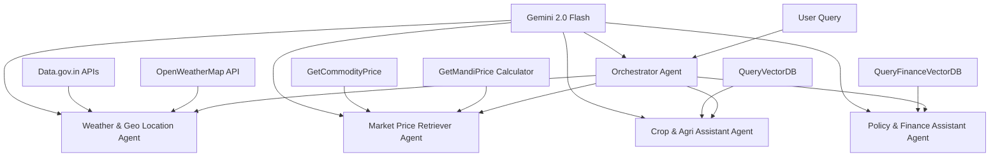

# AgriVerse: Smart Multi-Agent Agricultural Intelligence Platform

## About AgriVerse
AgriVerse is an AI-powered agricultural advisory platform designed to provide comprehensive farming intelligence through a multi-agent system. The platform offers accessible and real-time agricultural expertise to farmers, specialists, and policymakers.

## Key Features
- **Multi-Agent Intelligence**: Domain-specific agents for weather, market prices, crop queries, and financial policies.
- **Multilingual Accessibility**: Support for multiple languages to ensure widespread accessibility.
- **Real-Time Data Integration**: Processing of local weather patterns, commodity rates, and government agricultural datastores.
- **Disease Classification**: PyTorch-based image classification using EfficientNet for plant disease detection.
- **Vector Search Contextualization**: ChromaDB semantic retrieval powered by HuggingFace embeddings.

## System Architecture



## Repository Structure
- **backend/**: FastAPI server hosting ChromaDB vector stores (`VectorDatabases/`) and PyTorch machine learning models (`models/`).
- **frontend/**: React Vite application styled with TailwindCSS and Shadcn UI.
- **workflows/**: n8n automated orchestrator workflows (Gemini, Groq, and custom Disease handling options).
- **docker-compose.yml**: Containerized orchestration for the entire workspace.

## Setup and Installation

### Prerequisites
- Docker and Docker Compose (recommended)
- Node.js (v18+) or Bun (for frontend local development)
- Python 3.12+ (for backend local development)

### Running with Docker (Recommended)
1. Build and start the containers using Docker Compose:
   ```bash
   docker-compose up --build
   ```
2. The platform processes will map to the following local endpoints:
   - Frontend Application: `http://localhost:3000`
   - Backend API: `http://localhost:8000`
   - n8n Automation: `http://localhost:5678`

### Local Development (Manual Setup)

#### 1. Backend
The backend initializes the vector store databases and the computer vision image classifier.
```bash
cd backend
python -m venv venv
source venv/bin/activate
pip install -r requirements.txt
python main.py
```

#### 2. Frontend
The frontend requires Node modules or Bun to compile React dependencies.
```bash
cd frontend
bun install
bun run dev
```

#### 3. Workflow Configuration (n8n)
Start a local n8n instance natively:
```bash
npx n8n
```

1. Access the n8n interface at `http://localhost:5678`.
2. Generate an empty initial workflow.
3. Import the required agent templates from the `workflows/` directory based on your use case:
   - `AgriVerse-n8n-Workflow-Gemini.json`: Utilizes Gemini 2.5 Flash to handle both image and text-based agricultural queries.
   - `AgriVerse-n8n-Workflow-Groq.json`: Leverages Llama 4 Scout 17B 16E Instruct via Groq to process both image and text-based agricultural queries.
   - `AgriVerse-n8n-Workflow-Groq-Disease.json`: Specialized workflow for disease classification utilizing a custom EfficientNet model (F1 score: 94.4), while also maintaining support for general text queries.
4. Configure required credentials for nodes in your chosen workflow:
   - **LLM Provider API Key**: Provide a valid Groq API key or Google Gemini API key based on the selected workflow.
   - **OpenWeatherMap API Key**: Required for the weather and geo-location agent.
   - **Data.gov.in API Key**: Required for market prices and commodity APIs. *Note: This must be set up using "Query Auth" as the credential type in n8n for the HTTP request nodes.*
5. Activate the workflow via the top-right toggle.
